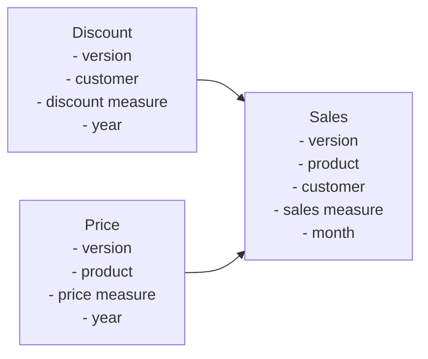

# tm1bench

## Overview
This is a simple model to 'benchmark' TM1 / Planning Analytics performance. Something like SData, but with a bit more, you know, data. 

It's a fully synthetic dataset that you can populate with a fairly large volume to test different performance settings / share with support without any data privacy considerations. 

TM1 model diagram:

## Tests available

None at the moment

Ideas:
- a TI per test with logoutput of test timing
- an overall Run Tests TI that will execute selected tests
- simple things like 'CellIncrement random value / Read a total view' should allow playing with MTQ or VMM / VMT settings

## How to use

1. Pull the `tm1bench` branch of this repository to your tm1 server (ideally an empty one, but it's not necessary)
2. Run `tm1bench Setup` with the parameters of how many elements you want in the dimensions and how much data to have in sales cube (as a rule of thumb, 10 million cells translate to 100 Mb RAM Sales cube)
3. After you're done run `tm1bench Cleanup` and it'll remove all the generated objects. It will delete the TI process files, but they will still be visible until a model restart.
