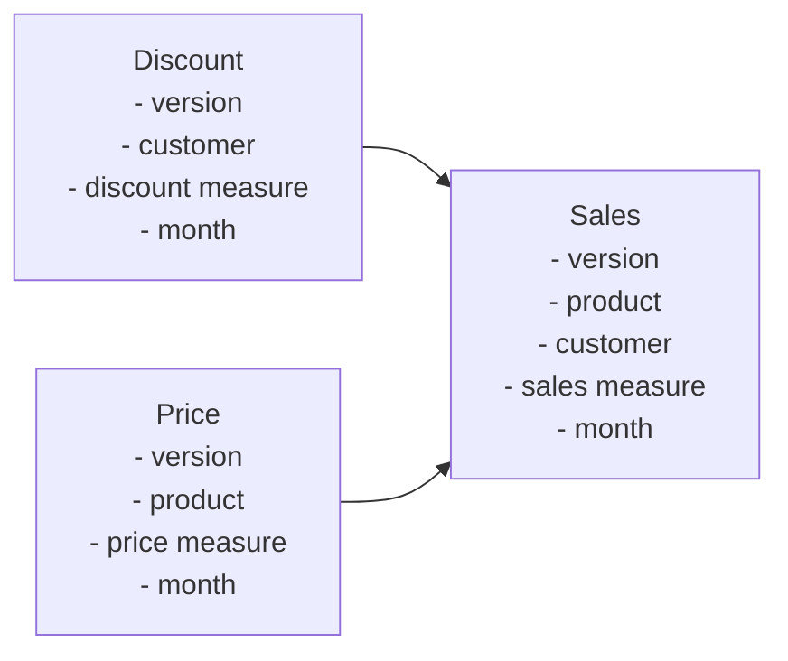

# tm1bench
This is a simple tool to 'benchmark' TM1 / Planning Analytics performance. 
## Why

## Overview

TM1 model diagram:

```mermaid
%%{init: {"flowchart" }%%
flowchart LR
    discount["`Discount
    - version
    - customer
    - discount measure
    - month`"]
    price["`Price
    - version
    - product
    - price measure
    - month`"]
    sales["`Sales
    - version
    - product
    - customer
    - sales measure
    - month`"]
    discount --> sales
    price --> sales
```

## How to use

